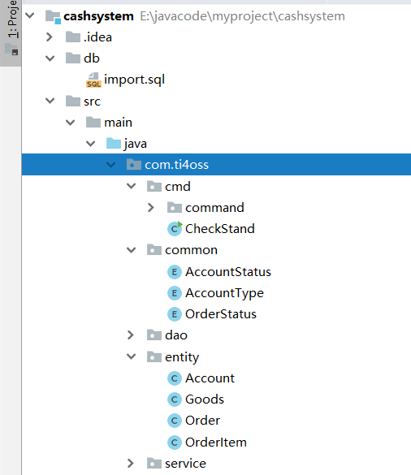
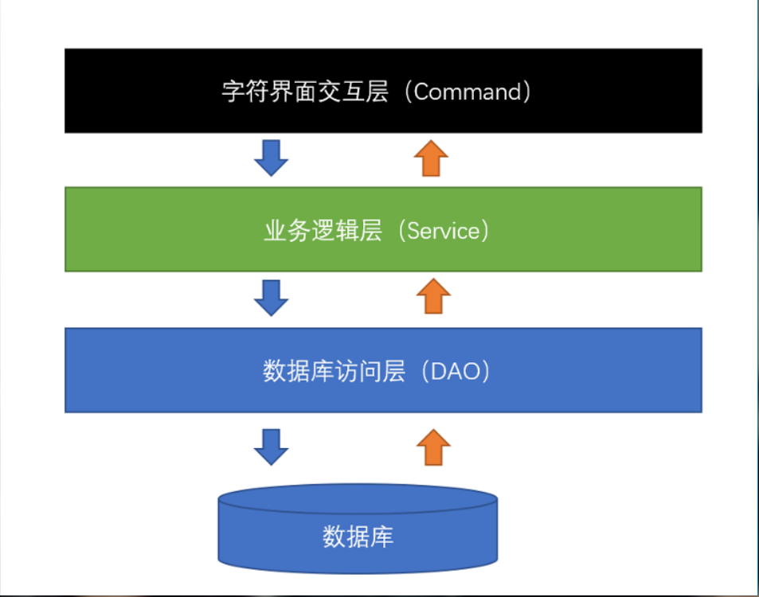
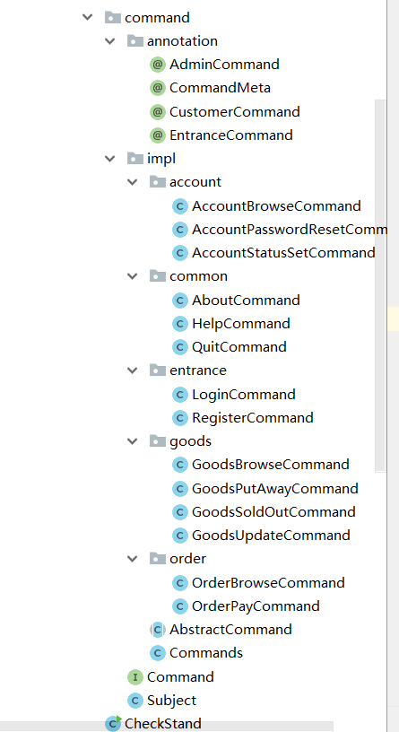

## 授课指南

### 第1节大纲：需求分析，功能整理，数据库表设计，模型抽象，项目搭建.实体类设计

#### 功能整理

> 实现功能：
>
> **客户端 **
>
> 1、商品信息
> 1.1 浏览商品(LLSP)
>
> 2、公共命令
> 2.1 帮助信息(BZ)
> 2.2 退出系统(TC)
> 2.3 关于系统(GY)
>
> 3、我的订单
> 3.1 取消订单(QXDD)
> 3.2 支付订单(ZFDD)
> 3.3 查看订单(CKDD)
>
> **管理员端**
>
> 1、帐号信息
> 1.1 启停帐号(QTZH)	
> 1.2 重置密码(CZMM)
> 1.3 查看帐号(CKZH)
>
> 2、商品信息
> 2.1 上架商品(SJSP)
> 2.2 下架商品(XJSP)
> 2.3 浏览商品(LLSP)
> 2.4 更新商品(GXSP)
>
> 3、公共命令
> 3.1 帮助信息(BZ)
> 3.2 关于系统(GY)
> 3.3 退出系统(TC)
>

#### 数据库表设计

> **(参照 数据库设计.emmx  和《收银台.xlsx》  )**
>
> 通过功能的分析：我们可以分析出我们将要建立的数据库表大概有这几张表：
>
> 1.账户：account
>
> 2.商品：goods
>
> 3.订单：order
>
> 4.订单项：order_item
>

```sql
-- 数据库
drop database if exists `check_stand`;
create database if not exists `check_stand` character set utf8;

-- 使用数据库
use `check_stand`;

-- 帐号
drop table if exists `account`;
create table if not exists `account`
(
  --id类型为int  primary key定义这个字段为主键 并且是自增长
    id             int primary key auto_increment comment '帐号编号',
    username       varchar(12)   not null comment '帐号',
    password       varchar(128)  not null comment '密码',
    name           varchar(32)   not null comment '姓名',
    account_type   int default 1 not null comment '帐号类型 1 管理员 2 客户',
    account_status int default 1 not null comment '帐号状态 1 启用   2 锁定'
);
-- 商品信息
drop table if exists `goods`;
create table if not exists `goods`
(
    id        int primary key auto_increment comment '商品编号',
    name      varchar(128)              not null comment '商品名称',
    introduce varchar(256) default '暂无' not null comment '商品简介',
    stock     int                       not null comment '商品库存',
    unit      varchar(12)               not null comment '库存单位',
    price     int                       not null comment '商品价格，单位：分',
    discount  int          default 100  not null comment '商品折扣，[0,100]'
);

-- 订单
drop table if exists `order`;
create table if not exists `order`
(
    id            varchar(32) primary key comment '订单编号',
    account_id    int         not null comment '帐号编号',
    account_name  varchar(12) not null comment '帐号',
    create_time   datetime    not null comment '创建时间',
    finish_time   datetime default null comment '完成时间',
    actual_amount int         not null comment '实际金额，单位：分',
    total_money   int         not null comment '总金额，单位：分',
    order_status  int         not null comment '支付状态 1 待支付 2 完成'
);
-- 订单项
drop table if exists `order_item`;
create table if not exists `order_item`
(
    id              int primary key auto_increment comment '订单条目编号',
    order_id        varchar(32)               not null comment '订单编号',
    goods_id        int                       not null comment '商品编号',
    goods_name      varchar(128)              not null comment '商品名称',
    goods_introduce varchar(256) default '暂无' not null comment '商品简介',
    goods_num       int                       not null comment '商品数量',
    goods_unit      varchar(12)               not null comment '库存单位',
    goods_price     int                       not null comment '商品价格，单位：分',
    goods_discount  int          default 100  not null comment '商品折扣，[0,100]'
);
```


#### 模型抽象

> 通过数据库表的设计，我们可以抽象出几个实体类：
>
> 1.商品：Goods
>
> 2.账户：Account
>
> 3.订单：Order
>
> 4.订单项：OrderItem 
>
> 每个实体类的数据成员就是我们数据库表的字段。

#### 项目搭建




我们可以看到分为了cmd层，common(公共层)，dao层 ，entity层，service层。



1.Account类实现

```java
package com.ti4oss.entity;
import com.ti4oss.common.AccountStatus;
import com.ti4oss.common.AccountType;
import lombok.Data;
/**
 * Created with IntelliJ IDEA.
 * Description:
 会为类的所有属性自动生成setter/getter、equals、canEqual、hashCode、toString方法，如为final属性，则不会为该属性生成setter方法。
 * User: GAOBO
 * Date: 2019-06-26
 * Time: 13:51
 */
@Data
public class Account {
    private Integer id;
    private String username;
    private String password;
    private String name;
    private AccountType accountType;//账户类型
    private AccountStatus accountStatus;//账户状态
}

```

2.Goods

```java
package com.ti4oss.entity;
import lombok.Data;
/**
 * Created with IntelliJ IDEA.
 * Description:
 * User: GAOBO
 * Date: 2019-06-26
 * Time: 13:59
 */
@Data
public class Goods {
    private Integer id;//商品id
    private String name;//商品名称
    private String introduce;//商品简介
    private Integer stock;//库存
    private String unit;//库存个数
    private Integer price;//价格
    private Integer discount;//折扣
    //需要购买的 货物的 数量   后期支付时需要
    private Integer buyNum;

    @Override
    public String toString() {

        StringBuilder sb = new StringBuilder();
        sb.append("【商品信息】:").append("\n")
                .append("【商品编号】").append(this.getId()).append("\n")
                .append("【商品名称】").append(this.getName()).append("\n")
                .append("【商品简介】").append(this.getIntroduce()).append("\n")
                .append("【商品库存】").append(this.getStock()).append(this.getUnit()).append("\n")
                .append("【商品价格】") .append(String.format("%.2f", 1.00D * this.getPrice() / 100)).append(" (元) ").append("\n")
                .append("【商品折扣】").append(this.getDiscount()).append("折").append("\n");
        sb.append("======================================================");
        return sb.toString();
    }
}

```

3.Order

```java
package com.ti4oss.entity;
import com.ti4oss.common.OrderStatus;
import lombok.Data;

import java.time.LocalDateTime;
import java.util.ArrayList;
import java.util.List;

/**
 * Created with IntelliJ IDEA.
 * Description:
 * User: GAOBO
 * Date: 2019-06-26
 * Time: 13:59
 */
@Data
public class Order {
    private String id;
    private Integer accountId;
    private String accountName;
    private LocalDateTime createTime;
    private LocalDateTime finishTime;
    private Integer actualAmount;
    private Integer totalMoney;
    private OrderStatus orderStatus;

    //存放订单项
    private List<OrderItem> orderItemList = new ArrayList<>();
    @Override
    public String toString() {
        StringBuilder sb = new StringBuilder();
        sb.append("【订单信息】*************************************").append("\n");
        sb.append("\t").append("【用户名称】：").append(this.getAccountName()).append("\n");
        sb.append("\t").append("【订单编号】：").append(this.getId()).append("\n");
        sb.append("\t").append("【订单状态】：").append(this.getOrderStatus().getDesc()).append("\n");
        sb.append("\t").append("【创建时间】：").append(this.timeToString(this.getCreateTime())).append("\n");
        if (this.getOrderStatus() == OrderStatus.OK) {
            sb.append("\t").append("【完成时间】：")
                    .append(this.timeToString(this.getFinishTime())).append("\n");
        }
        sb.append("【订单明细】*************************************").append("\n");
        sb.append("\t编号   名称     数量     单位     单价（元）").append("\n");
        int i = 0;
        for (OrderItem orderItem : this.getOrderItemList()) {
            sb.append("\t").append(++i).append(".  ")
                    .append(orderItem.getGoodsName()).append("   ")
                    .append(orderItem.getGoodsNum()).append("   ")
                    .append(orderItem.getGoodsUnit()).append("  ")
                    .append(this.moneyToString(orderItem.getGoodsPrice())).append("  ")
                    .append("\n");
        }
        sb.append("【订单金额】*************************************").append("\n");
        sb.append("\t").append("【总金额】：").append(this.moneyToString(this.getTotalMoney()))
                .append(" 元 ").append("\n");
        sb.append("\t").append("【优惠金额】：").append(this.moneyToString(this.getDiscount()))
                .append(" 元 ").append("\n");
        sb.append("\t").append("【应支付金额】：").append(this.moneyToString(this.getActualAmount()))
                .append(" 元 ").append("\n");
        return sb.toString();
    }

    private String moneyToString(int money) {
        return String.format("%.2f", 1.00D * money / 100);
    }

    private String timeToString(LocalDateTime time) {
        return DateTimeFormatter.ofPattern("yyyy/MM/dd HH:mm:ss").format(time);
    }

    //优惠
    public Integer getDiscount() {
        return this.getTotalMoney() - this.getActualAmount();
    }
}

```

4.OrderItem

```java
package com.ti4oss.entity;

import lombok.Data;

/**
 * Created with IntelliJ IDEA.
 * Description:
 * User: GAOBO
 * Date: 2019-06-26
 * Time: 14:00
 */
@Data
public class OrderItem {
    private Integer id;
    private String orderId;
    private Integer goodsId;
    private String goodsName;
    private String goodsIntroduce;
    private Integer goodsNum;
    private String goodsUnit;
    private Integer goodsPrice;
    private Integer goodsDiscount;
}

```

5.AccountStatus

```java
package com.ti4oss.common;
import lombok.Getter;
import lombok.ToString;
/**
 * Created with IntelliJ IDEA.
 * Description:
 * User: GAOBO
 * Date: 2019-06-28
 * Time: 17:00
 */
@Getter
@ToString
public enum AccountStatus {

    UNLOCK(1,"启用"),LOCK(2,"启停");

    private int flag;
    private String desc;
    AccountStatus(int flg,String desc) {
        this.desc = desc;
        this.flag = flg;
    }
    //查找值为flag 的状态 是启用 还是启停
    public static AccountStatus valueOf(int flag) {
        for(AccountStatus accountStatus :values()) {
            if(accountStatus.flag == flag) {
                return accountStatus;
            }
        }
        throw  new RuntimeException("AccountStatus flag " + flag + " not found.");
    }
}

```

6.AccountType

```java
package com.ti4oss.common;
import lombok.Getter;
import lombok.ToString;
/**
 * Created with IntelliJ IDEA.
 * Description:
 * User: GAOBO
 * Date: 2019-06-28
 * Time: 15:45
 */
@Getter
@ToString
public enum AccountType {
    ADMIN(1,"管理员"),CUSTOMER(2,"客户");

    private int flag;
    private String desc;

    AccountType(int flag,String desc) {
        this.flag = flag;
        this.desc = desc;
    }

    public static AccountType valueOf(int flag) {
        for (AccountType accountTypes : values()) {
            if(accountTypes.flag == flag) {
                return accountTypes;
            }
        }
        throw  new RuntimeException("AccountType flag " + flag + " not found.");
    }

}
```

7.OrderStatus

```java
package com.ti4oss.common;

import lombok.Getter;
import lombok.ToString;

/**
 * Created with IntelliJ IDEA.
 * Description:
 * User: GAOBO
 * Date: 2019-06-28
 * Time: 17:00
 */
@Getter
@ToString
public enum OrderStatus {

    PAYING(1, "待支付"), OK(2, "完成");

    private final int flag;
    private final String desc;

    OrderStatus(int flag, String desc) {
        this.flag = flag;
        this.desc = desc;
    }
    //传入flg 为1 或者2    返回状态的对象 OrderStatus
    public static OrderStatus valueOf(int flag) {
        for (OrderStatus orderStatus : OrderStatus.values()) {
            if (orderStatus.flag == flag) {
                return orderStatus;
            }
        }
        throw new RuntimeException("Not found flag = " + flag +
                " in OrderStatus");
    }
}

```


### 第2节项目实现：命令行字符界面设计，搭建；

#### 1、命令行字符界面设计，搭建. (整个命令行字符的搭建依赖于，登录注册功能的实现，这样才能更好的观察。)



带领实现 common  entrance  以及类  Commands .

字符界面的搭建 (分为管理员端  和  用户端   **命令类型：入口命令，管理员命令，用户命令**)            需要把登录注册实现       Commands 类的实现尤其重要 

Commands 类实现要点：

1、首先需要定义**Set<Command> COMMANDS = new HashSet<>() **存放的是所有命令的集合 ,使用Collections.addAll(COMMANDS ,  XXXXXXXXX ）进行存放

2、final Command CACHED_HELP_COMMAND 用来缓存入口命令

3、key为 命令字符串如：DL    value为命令对象

```java
public static final Map<String,Command>  ADMIN_COMMANDS = new HashMap<>();

public static final Map<String,Command>  CUSTOMER_COMMANDS = new HashMap<>();

public static final Map<String,Command>  ENTRANCE_COMMANDS = new HashMap<>();
```

代码实现：

**Subject.java**

此文件作为我们整个项目的观察对象，不同的账户类型，不同的操作。

```java
package com.ti4oss.cmd.command;

import com.ti4oss.entity.Account;

/**
 * Created with IntelliJ IDEA.
 * Description:观察对象
 * User: GAOBO
 * Date: 2019-06-28
 * Time: 20:38
 */
public class Subject {
    private Account account;

    public void setAccount(Account account) {
        this.account = account;
    }

    public Account getAccount() {
        return account;
    }

}

```

**AbstractCommand.java**  此java文件主要作用，启动所有的服务，因为每个命令，都需要通过service层去操作dao层，这里统一启动，只需统一继承就好。

```java
//后续有需要 暂且不提出来
public abstract class AbstractCommand implements Command {
    public AccountService accountService;
    public GoodsService goodsService;
    public OrderService orderService;
    public AbstractCommand() {
        this.accountService = new AccountService();
        this.goodsService = new GoodsService();
        this.orderService = new OrderService();
    }
}
```

**Command.java** 此接口文件，定义了Scanner对象，因为每个命令都需要在命令行输入内容，我们只需要一个对象

```java
package com.ti4oss.cmd.command;

import java.io.Console;
import java.util.Scanner;

/**
 * Created with IntelliJ IDEA.
 * Description:
 * User: GAOBO
 * Date: 2019-06-28
 * Time: 19:49
 */
public interface Command {

    //每个命令都会创建Scanner对象 在这里直接创建
    Scanner scanner = new Scanner(System.in);
    
    //统一调用此方法
    void execute(Subject subject);
}

```

**Commands.java** 将所有命令进行整合和分类，利用反射进行分类，然后分别获取不同Map的命令。

```java
/**
 * Created with IntelliJ IDEA.
 * Description: 把所有命令进行整合和分类
 * User: GAOBO
 * Date: 2019-06-29
 * Time: 20:13
 */
public class Commands {
    /**
     * 存放所有命令对象的集合
     */
    private static final Set<Command> COMMANDS = new HashSet<>();

    private static final Command CACHED_HELP_COMMAND;
    //key为 命令字符串 例如：DL    value为命令对象
    public static final Map<String,Command>  ADMIN_COMMANDS = new HashMap<>();
    public static final Map<String,Command>  CUSTOMER_COMMANDS = new HashMap<>();
    public static final Map<String,Command>  ENTRANCE_COMMANDS = new HashMap<>();

    static {
            Collections.addAll(COMMANDS,
                new LoginCommand(),
                new RegisterCommand(),
                new AboutCommand(),
                new QuitCommand(),
                //----------
                CACHED_HELP_COMMAND = new HelpCommand(),

                new AccountBrowseCommand(),
                new AccountPasswordResetCommand(),
                new AccountStatusSetCommand(),
                new GoodsBrowseCommand(),
                new GoodsPutAwayCommand(),
                new GoodsSoldOutCommand(),
                new GoodsUpdateCommand(),
                new OrderBrowseCommand(),
                new OrderCancelCommand(),
                new OrderPayCommand(),
                );
        //对命令进行分类   根据注解分类
        for (Command command : COMMANDS) {
            Class<?> cls = command.getClass();

            AdminCommand adminCommand = cls.getDeclaredAnnotation(AdminCommand.class);
            CustomerCommand customerCommand = cls.getDeclaredAnnotation(CustomerCommand.class);
            EntranceCommand entranceCommand = cls.getDeclaredAnnotation(EntranceCommand.class);

            CommandMeta commandMeta = cls.getDeclaredAnnotation(CommandMeta.class);
            if(commandMeta == null) {
                continue;
            }
            //将commandMeta的name转化为字符串
            String commandKey = commandMeta.name();
            

            if(adminCommand != null) {
                ADMIN_COMMANDS.put(commandKey,command);
            }
            if(customerCommand != null) {
                CUSTOMER_COMMANDS.put(commandKey,command);
            }
            if(entranceCommand != null) {
                ENTRANCE_COMMANDS.put(commandKey,command);
            }
        }
    }

    public static Command getCachedHelpCommand(){
        return CACHED_HELP_COMMAND;
    }
    //入口命令展示   用户账户为空  还没有进行登录或者注册
    public static Command getEntranceCommand (String commandKey) {
       return getCommand(commandKey,ENTRANCE_COMMANDS);
    }
    //管理员命令展示  根据用户输入的命令进行展示
    public static Command getAdminCommand (String commandKey) {
        return getCommand(commandKey,ADMIN_COMMANDS);
    }
	//用户命令展示  根据用户输入的命令进行展示
    public static Command getCustomerCommand (String commandKey) {
        return getCommand(commandKey,CUSTOMER_COMMANDS);
    }

	//遍历MAP 返回对应的key值     entrySet()存放的是键值对 K-V
    private static Command getCommand(String commandKey,Map<String,Command> commandMap) {
        
        return commandMap.getOrDefault(commandKey, CACHE_HELP_COMMANDS);
        
        /*for (Map.Entry<String ,Command> entry: commandMap.entrySet()) {
            if (entry.getKey().contains(command)) {
                return entry.getValue();
            }
        }
        //如果输入是回车什么的  在MAP里面没有  返回入口的命令
        return CACHED_HELP_COMMAND;*/
    }

}

```

**HelpCommand.java**

```java
/**
 * Created with IntelliJ IDEA.
 * Description:  HelpCommand.java
 * User: GAOBO
 * Date: 2019-06-29
 * Time: 20:03
 */
@CommandMeta(
        name = {"BZ"},
        desc = "帮助信息",
        group = "公共命令"
)
@EntranceCommand
@AdminCommand
@CustomerCommand
public class HelpCommand extends AbstractCommand {
    
    @Override
    public void execute(Subject subject) {
        Account account = subject.getAccount();
        //没有注册账号  提示入口命令
        if (account == null) {
            entranceHelp();
        } else {
            switch (account.getAccountType()) {
                case ADMIN:
                    adminHelp();
                    break;
                case CUSTOMER:
                    customerHelp();
                    break;
                default:
            }
        }
    }
    
    private void entranceHelp() {
        printHelp("欢迎", Commands.ENTRANCE_COMMANDS.values());
    }
    
    private void adminHelp() {
        printHelp("管理端", Commands.ADMIN_COMMANDS.values());
    }
    
    private void customerHelp() {
        printHelp("客户端", Commands.CUSTOMER_COMMANDS.values());
    }
    
    //同种命令根据 group进行分类  装进新的Map  
    private void printHelp(String title, Collection<Command> collection) {
        System.out.println("******************** " + title + " ***********************");
       	//key-group  value-List<String> funcs
        Map<String, List<String>> helpInfo = new HashMap<>();
        for (Command command : collection) {
            //这是Java 8中新增的，
            // 该方法获取直接修饰该class对象对应类的指定类型的Annotation，如果不存在，则返回null
            CommandMeta commandMeta = command.getClass().getDeclaredAnnotation(CommandMeta.class);
           
            String group = commandMeta.group();
            
            List<String> funcs = helpInfo.get(group);
            if(funcs == null) {
                funcs = new ArrayList<>();
                helpInfo.put(group,funcs);
            }
            funcs.add(commandMeta.desc() + "(" + (commandMeta.name()) + ")");
            
            
            /**
             * java8之前。从map中根据key获取value操作可能会有下面的操作
             * Object key = map.get("key");
             * if (key == null) {
             *     key = new Object();
             *     map.put("key", key);
             * }
             * // java8之后。上面的操作可以简化为一行，
             * 若key对应的value为空，会将第二个参数的返回值存入并返回
             * Object key2 = map.computeIfAbsent("key", k -> new Object());
             * */
            //在helpInfo中 找K - group对应的V   如果没有存入Map
            //List<String> funcs = helpInfo.computeIfAbsent(group, s -> new ArrayList<>());
            //funcs.add(commandMeta.desc()+"("+ commandMeta.name() +")");
        }
        int i = 0;
          //Map中采用Entry内部类来表示一个映射项，映射项包含Key和Value
        //Map.Entry里面包含getKey()和getValue()方法
        //entrySet 键-值 对的集合
        for (Map.Entry<String, List<String>> entry : helpInfo.entrySet()) {
            i++;
            System.out.println(i + ". " + entry.getKey());//公共命令
            int j = 0;
            for (String item : entry.getValue()) {// 上面的 funcs.add：commandMeta.desc()+ commandMeta.name()
                j++;
                System.out.println("\t" + (i) + "." + (j) + " " + item);
            }
        }
        System.out.println("输入菜单括号后面的编号（忽略大小写），进行下一步操作");
        System.out.println("*************************************************");
    }

}
```

**CheckStand.java**

逻辑：执行execute函数，将缓存命令进行展示。然后提示输入命令，区分是管理员还是用户，不同的用户，展示的命令不一样。

```java
/**
 * Created with IntelliJ IDEA.
 * Description:
 * User: GAOBO
 * Date: 2019-06-28
 * Time: 18:25
 */
public class CheckStand extends AbstractCommand {

    public static void main(String[] args) {
        Subject subject = new Subject();
        new CheckStand().execute(subject);
    }


    @Override
    public void execute(Subject subject) {
        //System.out.println("帮助命令"); 先把进入程序的命令进行缓存
        Commands.getCachedHelpCommand().execute(subject);
        while(true) {
            System.out.println(">>");
            String line = scanner.nextLine();
            //转化为大写
            String commandCode = line.trim().toUpperCase();
            Account account = subject.getAccount();
            if(account == null) {
                //假设输入DL,会在这个Map里面进行查找
                Commands.getEntranceCommand(commandCode).execute(subject);
            }else {
                //System.out.println("account != null");
                switch (account.getAccountType()) {
                    case ADMIN:
                        Commands.getAdminCommand(commandCode).execute(subject);
                        break;
                    case CUSTOMER:
                        Commands.getCustomerCommand(commandCode).execute(subject);
                        break;
                    default:
                }
            }
        }
    }
}
```

**LoginCommand.java**

登录逻辑：当用户输入登录DL命令之后，首先判断该账户是否已经登录，如果没有登录，输入用户名和密码，通过 **accountService.login(username,password)**的登录函数进行验证。该函数返回一个account。

登录成功与否的判断：如果返回值不为空，并且该账户是启用状态，登录成功，同时将观察对象Subject的setAccount,进行设置。

```java
/**
 * Created with IntelliJ IDEA.
 * Description:
 * User: GAOBO
 * Date: 2019-06-29
 * Time: 20:03
 */
@CommandMeta(
        name = {"DL"},
        desc = "登录",
        group = "入口命令"
)
@EntranceCommand
public class LoginCommand extends AbstractCommand {
    @Override
    public void execute(Subject subject) {
        System.out.println("登录");
        Account account = subject.getAccount();
        if(account != null) {
            System.out.println("已经登录过了");
            return;
        }
        System.out.println("请输入用户名：");
        String username = Command.scanner.nextLine();
        System.out.println("请输入密码：");
        String password = Command.scanner.nextLine();
        //去数据查询是否有此账户，有返回，无返回null
        account = this.accountService.login(username,password);

        if(account != null && account.getAccountStatus() == AccountStatus.UNLOCK) {
            System.out.println(account.getAccountType().getDesc()+"登录成功");
            subject.setAccount(account);
        }else {
            System.out.println("登录失败，密码或者用户名错误");
        }
    }
}
```

**RegisterCommand.java**

```java
/**
 * Created with IntelliJ IDEA.
 * Description:
 * User: GAOBO
 * Date: 2019-06-29
 * Time: 20:03
 */
@CommandMeta(
        name = {"ZC","REGISTER"},
        desc = "注册",
        group = "入口命令"
)
@EntranceCommand
public class RegisterCommand extends AbstractCommand {
    @Override
    public void execute(Subject subject) {
        System.out.println("注册");
        System.out.println("请输入用户名：");
        String username = this.scanner.nextLine();
        //检查用户名是否一致 AccountService -->  AccountDao
        System.out.println("请输入密码：");
        String password1 = scanner.nextLine();
        System.out.println("请再次输入密码：");
        String password2 = scanner.nextLine();
        if(!password1.equals(password2)) {
            System.out.println("两次输入的密码不一致");
            return;
        }
        System.out.println("请输入姓名：");
        String name = scanner.nextLine();
        System.out.println("请输入账户类型：1.管理员  2.客户");
        int accountTypeFlag = scanner.nextInt();
        AccountType accountType = AccountType.valueOf(accountTypeFlag);

        final Account account = new Account();
        account.setUsername(username);
        account.setPassword(password1);
        account.setAccountType(accountType);
        account.setName(name);
        account.setAccountStatus(AccountStatus.UNLOCK);

        boolean effect = this.accountService.register(account);
        if(effect) {
            System.out.println("恭喜注册成功");
        }else {
            System.out.println("注册失败");
        }

    }
}

```

Service层：

**AccountService.java**

```java
/**
 * Created with IntelliJ IDEA.
 * Description:
 * User: GAOBO
 * Date: 2019-06-30
 * Time: 13:55
 */
public class AccountService {
    private AccountDao accountDao;
    public AccountService() {
        this.accountDao = new AccountDao();
    }

    public Account login(String name,String password) {
        return this.accountDao.login(name,password);
    }

    public boolean register(Account account){
        return this.accountDao.register(account);
    }

    public List<Account> queryAllAccount() {
        return this.accountDao.queryAllAccount();
    }
}
```


DAO层：

**BaseDao.java**

```java
/**
 * Created with IntelliJ IDEA.
 * Description:数据库连接池的链接方式  优点：频繁的链接数据库使用
 * User: GAOBO
 * Date: 2019-06-30
 * Time: 14:22
 */
public class BaseDao {
    //DataSource 获取数据库连接的规范
    private static  DataSource dataSource;

    //使用DataSource 链接Mysql
     private DataSource getDataSource() {
        if (dataSource == null) {
            synchronized(DataSource.class) {
                if (dataSource == null) {
                    dataSource = new MysqlDataSource();
                   String host = "127.0.0.1";
                   String port = "3306";
                    ((MysqlDataSource) dataSource).setUrl("jdbc:mysql://" + (host + ":" + port) + "/check_stand");
                    ((MysqlDataSource) dataSource).setUser("root");
                    ((MysqlDataSource) dataSource).setPassword("111111");
                }
            }
        }
        return dataSource;
    }
    //
    protected Connection getConnection(boolean autoCommit) throws SQLException {
        //获取与MySQl数据库的连接
        Connection connection = this.getDataSource().getConnection();
        //true：sql命令的提交（commit）由驱动程序负责
        connection.setAutoCommit(autoCommit);
        return connection;
    }

    protected void closeResource(ResultSet resultSet, PreparedStatement statement, Connection connection) {
        //结果 -> 命令 -> 连接
        if (resultSet != null) {
            try {
                resultSet.close();
            } catch (SQLException e) {
                e.printStackTrace();
            }
        }
        if (statement != null) {
            try {
                statement.close();
            } catch (SQLException e) {
                e.printStackTrace();
            }
        }
        if (connection != null) {
            try {
                connection.close();
            } catch (SQLException e) {
                e.printStackTrace();
            }
        }
    }
}
```

**AccountDao.java**

```java
/**
 * Created with IntelliJ IDEA.
 * Description:
 * User: GAOBO
 * Date: 2019-06-30
 * Time: 13:55
 */
public class AccountDao extends BaseDao{
    //登录
    public Account login(String username,String password) {
        //连接数据库\
        Connection connection = null;
       //先将Sql语句进行预编译存储到PreparedStatement对象  可以使用此对象多次高效地执行改语句
        // 适合用于多次执行的SQL语句，可以防止SQL注入  预编译好之后，不用再次编译，提高了效率
        // 最终会生成一个ResultSet对象  支持批处理  适合批量操作
        // 该对象将生成具有给定类型和并发性的 ResultSet 对象；
        PreparedStatement preparedStatement = null;
        ResultSet resultSet = null;
        // 该对象将生成具有给定类型和并发性的 ResultSet 对象；
        Account account = null;

        try {
            //和数据库建立连接
            connection = this.getConnection(true);
            String sql = "select id, username, password, name,account_type, account_status from account where username=? and password=?";
            preparedStatement = connection.prepareStatement(sql);
            preparedStatement.setString(1,username);
            preparedStatement.setString(2,DigestUtils.md5Hex(password));
            //这个函数去执行sql语句  找到对应的用户名和密码的账户
            resultSet = preparedStatement.executeQuery();
            if(resultSet.next()) {
                account = this.extractAccount(resultSet);
            }
        }catch (SQLException e){
            e.printStackTrace();
        }finally {
            //关闭所有的数据库的资源
            this.closeResource(resultSet,preparedStatement,connection);
        }
        return account;
    }


    //将集合resultSet内的账户信息提取出来  封装为 Account
    private Account extractAccount(ResultSet resultSet) throws SQLException {
        Account account = new Account();
        account.setId(resultSet.getInt("id"));
        account.setUsername(resultSet.getString("username"));
        account.setPassword(resultSet.getString("password"));
        account.setName(resultSet.getString("name"));
        //这里在数据中存放的是整形的account_type  通过它 拿到一个完整的枚举类型
        account.setAccountType(AccountType.valueOf(resultSet.getInt("account_type")));
        account.setAccountStatus(AccountStatus.valueOf(resultSet.getInt("account_status")));
        return account;
    }

    //注册
    public boolean register(Account account) {
        Connection connection = null;

        PreparedStatement preparedStatement = null;
        ResultSet resultSet = null;

        boolean effect = false;
        try{
            connection = this.getConnection(true);
            String sql = "insert into account (username,password,name,account_type,account_status) values (?,?,?,?,?)";
            preparedStatement = connection.prepareStatement(sql,Statement.RETURN_GENERATED_KEYS);// 获取刚刚插入语句的ID值
            preparedStatement.setString(1,account.getUsername());
            preparedStatement.setString(2,DigestUtils.md5Hex(account.getPassword()));
            preparedStatement.setString(3,account.getName());
            preparedStatement.setInt(4,account.getAccountType().getFlag());
            preparedStatement.setInt(5,account.getAccountStatus().getFlag());
            //更新数据库
            effect = (preparedStatement.executeUpdate() == 1);
            //获取当前数据库当中的主键 存放至集合resultSet
            resultSet = preparedStatement.getGeneratedKeys();
            if(resultSet.next()) {
                Integer id = resultSet.getInt(1);
                account.setId(id);
            }

        }catch (SQLException e) {
            e.printStackTrace();
        }finally {
            this.closeResource(resultSet,preparedStatement,connection);
        }
        return effect;
    }
    //查询所有账户信息
    public List<Account> queryAllAccount() {
        Connection connection = null;

        PreparedStatement preparedStatement = null;
        ResultSet resultSet = null;

        List<Account> accountList = new ArrayList<>();


        try {
            connection = this.getConnection(true);
            String sql = "select id,username,password,name,account_type, account_status from account";
            preparedStatement = connection.prepareStatement(sql);
            resultSet = preparedStatement.executeQuery();

            while (resultSet.next()) {
                accountList.add(this.extractAccount(resultSet));
            }

        }catch (SQLException e) {
            e.printStackTrace();
        }finally {
            this.closeResource(resultSet,preparedStatement,connection);
        }
        return accountList;
    }
    
    //检查是否重名
    public boolean checkUserName(String userName) {
        //String sql = "select * from account where username=?";
        return false;
    }
}

```

#### 2、账号和商品的客户端层，业务层和数据库实现

**功能一：浏览商品GoodsBrowseCommand.java：**

```java
/**
 * Created with IntelliJ IDEA.
 * Description:
 * User: GAOBO
 * Date: 2019-06-29
 * Time: 20:03
 */
@CommandMeta(
        name = {"LLSP"},
        desc = "浏览商品",
        group = "商品信息"
)

@AdminCommand
@CustomerCommand
public class GoodsBrowseCommand extends AbstractCommand {
    @Override
    public void execute(Subject subject) {
        System.out.println("商品浏览");
        List<Goods> goodsList = this.goodsService.queryAllGoods();

        if(goodsList.isEmpty()) {
            System.out.println("么有任何的商品");
        }else {
            for (Goods goods : goodsList) {
                System.out.println(goods);
            }
        }
    }
}
```

**GoodsService.java对浏览商品的支持**

```java
public class GoodsService {

    public GoodsDao goodsDao;
    public GoodsService() {
        this.goodsDao = new GoodsDao();
    }

    public List<Goods> queryAllGoods() {
        return this.goodsDao.queryAllGoods();
    }
}
```


**GoodsDao.java对浏览商品的支持**

```java
/**
 * Created with IntelliJ IDEA.
 * Description:
 * User: GAOBO
 * Date: 2019-07-02
 * Time: 12:04
 */
public class GoodsDao extends BaseDao {

    //LLSP   查询所有货物商品信息
    public List<Goods> queryAllGoods() {
        Connection connection = null;

        PreparedStatement preparedStatement = null;
        ResultSet resultSet = null;
        List<Goods> goodsList = new ArrayList<>();
        try {
            connection = this.getConnection(true);
            String sql = "select id,name,introduce,stock,unit,price,discount from goods";
            preparedStatement = connection.prepareStatement(sql);
            resultSet = preparedStatement.executeQuery();
            while(resultSet.next()) {
                Goods goods = this.extractGoods(resultSet);
                if(goods != null) {
                    goodsList.add(goods);
                }
            }
        } catch (SQLException e) {
            e.printStackTrace();
        }finally {
            this.closeResource(resultSet,preparedStatement,connection);
        }
        return goodsList;
    }

    public Goods extractGoods(ResultSet resultSet) throws SQLException {
        Goods goods = new Goods();
        goods.setId(resultSet.getInt("id"));
        goods.setName(resultSet.getString("name"));
        goods.setIntroduce(resultSet.getString("introduce"));
        goods.setStock(resultSet.getInt("stock"));
        goods.setUnit(resultSet.getString("unit"));
        goods.setPrice(resultSet.getInt("price"));
        goods.setDiscount(resultSet.getInt("discount"));
        return goods;
    }
}

```


**功能二：商品的上架 **

**GoodsPutAwayCommand.java**

```java
/**
 * Created with IntelliJ IDEA.
 * Description:
 * User: GAOBO
 * Date: 2019-06-29
 * Time: 20:03
 */
@CommandMeta(
        name = {"SJSP"},
        desc = "上架商品",
        group = "商品信息"
)

@AdminCommand
@CustomerCommand
public class GoodsPutAwayCommand extends AbstractCommand {
    @Override
    public void execute(Subject subject) {
        System.out.println("上架商品");
        System.out.println("请输入商品名称：");
        String name = scanner.next();
        System.out.println("请输入商品简介：");
        String introduce = scanner.next();
        System.out.println("请输入商品单位：个，包，箱，瓶，千克");
        String unit = scanner.next();
        System.out.println("请输入商品库存：");
        int stock = scanner.nextInt();
        System.out.println("请输入商品价格：单位：元");
        //存入之前 把小数转换为整数存放到数据库  取的时候除以100就行
        int price = new Double(100 * scanner.nextDouble()).intValue();
        System.out.println("请输入商品折扣：75表示75折");
        int discount = scanner.nextInt();

        Goods goods = new Goods();
        goods.setName(name);
        goods.setIntroduce(introduce);
        goods.setStock(stock);
        goods.setUnit(unit);
        goods.setPrice(price);
        goods.setDiscount(discount);

        boolean effect = this.goodsService.putAwayGoods(goods);
        if(effect) {
            System.out.println("上架成功");
        }else{
            System.out.println("上架失败");
        }
    }
}
```

**GoodsService.java对上架商品的支持**

```java
//上架商品
public boolean putAwayGoods(Goods goods) {
    return this.goodsDao.putAwayGoods(goods);
}
```

**GoodsDao.java对上架商品的支持**

```java
//上架商品
public boolean putAwayGoods (Goods goods) {
    Connection connection = null;

    PreparedStatement preparedStatement = null;
    boolean effect = false;

    ResultSet resultSet = null;

    try {
        connection = this.getConnection(true);
        String sql = "insert into goods (name,introduce,stock,unit,price,discount) value(?,?,?,?,?,?)";
        //发送sql语句到数据库，且获取自动增加的id号
        preparedStatement = connection.prepareStatement(sql,Statement.RETURN_GENERATED_KEYS);
        preparedStatement.setString(1,goods.getName());
        preparedStatement.setString(2,goods.getIntroduce());
        preparedStatement.setInt(3,goods.getStock());
        preparedStatement.setString(4,goods.getUnit());
        preparedStatement.setInt(5,goods.getPrice());
        preparedStatement.setInt(6,goods.getDiscount());
        effect = (preparedStatement.executeUpdate() == 1);
        //用来设置主键id   当前的自动i增长id 存放到了preparedStatement中
        resultSet = preparedStatement.getGeneratedKeys();
        if(resultSet.next()) {
            goods.setId(resultSet.getInt(1));
        }
    } catch (SQLException e) {
        e.printStackTrace();
    }
    return effect;
}
```

**功能三：商品的更新 **

**GoodsUpdateCommand.java**

```java
/**
 * Created with IntelliJ IDEA.
 * Description:
 * User: GAOBO
 * Date: 2019-06-29
 * Time: 20:04
 */
@CommandMeta(
        name = {"GXSP"},
        desc = "更新商品",
        group = "商品信息"
)
@AdminCommand
@CustomerCommand
public class GoodsUpdateCommand extends AbstractCommand {
    @Override
    public void execute(Subject subject) {
        System.out.println("更新商品信息");
        System.out.println("请输入需要更新的商品编号：");
        int goodsId = scanner.nextInt();
        Goods goods = this.goodsService.getGoods(goodsId);
        if(goods == null) {
            System.out.println("您输入的编号不存在");
        }else {
            System.out.println("商品的原信息如下：");
            System.out.println(goods);

            hitPrintln("请输入更新的商品简介:");
            String introduce = scanner.next();

            hitPrintln("请输入更新商品库存：");
            int stock = scanner.nextInt();

            hitPrintln("请输入更新的商品单位：个，包，箱，瓶，千克");
            String unit = scanner.next();

            hitPrintln("请输入更新商品价格：单位：元");
            //存入之前 把小数转换为整数存放到数据库  取的时候除以100就行
            int price = new Double(100 * scanner.nextDouble()).intValue();

            hitPrintln("请输入更新商品折扣：75表示75折");
            int discount = scanner.nextInt();

            System.out.println("请输入是否更新(y/n)");
            String confirm = scanner.next();

            if("y".equalsIgnoreCase(confirm)) {
                goods.setIntroduce(introduce);
                goods.setUnit(unit);
                goods.setStock(stock);
                goods.setPrice(price);
                goods.setDiscount(discount);
                //去更新数据库
                boolean effect = this.goodsService.updateGoods(goods);
                if(effect){
                    System.out.println("更新商品成功");
                }else {
                    System.out.println("更新失败");
                }
            }
        }
    }
}
```

**GoodsService.java对更新商品的支持**

```java
//更新商品之 根据用户输入id进行查找对应货物
    public Goods getGoods(int goodsId) {
        return this.goodsDao.queryGoodsById(goodsId);
    }

    public boolean updateGoods(Goods goods) {
        return this.goodsDao.modifyGoods(goods);
    }
```

**GoodsDao.java对更新商品的支持**

```java
//查找id 对应 的货物是否存在
    public Goods queryGoodsById(int goodsId) {
        Connection connection = null;
        PreparedStatement preparedStatement = null;
        ResultSet resultSet = null;
        try{
            connection = this.getConnection(true);
            String sql = "select id,name,introduce,stock,unit,price,discount from goods where id = ?";
            preparedStatement = connection.prepareStatement(sql);

            preparedStatement.setInt(1,goodsId);

            resultSet = preparedStatement.executeQuery();
            if(resultSet.next()) {
                return this.extractGoods(resultSet);
            }
        } catch (SQLException e) {
            e.printStackTrace();
        }finally {
            this.closeResource(resultSet,preparedStatement,connection);
        }
        return null;
    }

    //更新商品信息
    public boolean modifyGoods(Goods goods) {
        Connection connection = null;
        PreparedStatement preparedStatement = null;

        try {
            connection = this.getConnection(true);
            String sql = "update goods set name=? , introduce =?,  stock=? , price=?, discount =? where  id= ?";
            preparedStatement = connection.prepareStatement(sql);

            preparedStatement.setString(1,goods.getName());
            preparedStatement.setString(2,goods.getIntroduce());
            preparedStatement.setInt(3,goods.getStock());
            preparedStatement.setInt(4,goods.getPrice());
            preparedStatement.setInt(5,goods.getDiscount());
            preparedStatement.setInt(6,goods.getId());

            return preparedStatement.executeUpdate() == 1;

        } catch (SQLException e) {
            e.printStackTrace();
        }finally {
            this.closeResource(null,preparedStatement,connection);
        }
        return false;
    }
```

**功能4：商品下架**

```java
/**
 * Created with IntelliJ IDEA.
 * Description:
 * User: GAOBO
 * Date: 2019-06-29
 * Time: 20:04
 */
@CommandMeta(
        name = {"XJSP"},
        desc = "下架商品",
        group = "商品信息"
)

@AdminCommand
@CustomerCommand
public class GoodsSoldOutCommand extends AbstractCommand {
    @Override
    public void execute(Subject subject) {
        System.out.println("下架商品");
        //根据商品下架的编号，先去 查询 是否有此商品 如果有通过
       // this.goodsService.soldOutGoods(goodsId); 去操作DAO层
        //进行 删除数据库 对应项
    }
}
```


#### 3、订单的客户端层，业务层和数据库层实现

**功能一：支付订单OrderPayCommand.java**

```java
package com.ti4oss.cmd.command.impl.order;

import com.ti4oss.cmd.command.Subject;
import com.ti4oss.cmd.command.annotation.CommandMeta;
import com.ti4oss.cmd.command.annotation.CustomerCommand;
import com.ti4oss.cmd.command.impl.AbstractCommand;
import com.ti4oss.common.OrderStatus;
import com.ti4oss.entity.Goods;
import com.ti4oss.entity.Order;
import com.ti4oss.entity.OrderItem;

import java.time.LocalDateTime;
import java.util.ArrayList;
import java.util.List;

/**
 * Created with IntelliJ IDEA.
 * Description:
 * User: GAOBO
 * Date: 2019-06-29
 * Time: 20:05
 */
@CommandMeta(
        name = "ZFDD",
        desc = "支付订单",
        group = "我的订单"
)
@CustomerCommand
public class OrderPayCommand extends AbstractCommand {

    @Override
    public void execute(Subject subject) {//货物id   账户List<Goods>,String int userid,userAccout
        System.out.println("请输入你要购买的货物id以及数量多个货物之间使用,号隔开：格式：1-8,3-5");
        String string = scanner.nextLine();
        String[] strings = string.split(",");

        List<Goods> goodsList =  new ArrayList<>();

        for (String str : strings ) {//1-8
            String[] strings2 = str.split("-");
            Goods goods = this.goodsService.getGoods(Integer.parseInt(strings2[0]));
            goods.setBuyNum(Integer.parseInt(strings2[1]));
            goodsList.add(goods);
        }

        Order order = new Order();
        order.setId(String.valueOf(System.currentTimeMillis()));
        order.setAccountId(subject.getAccount().getId());
        order.setAccountName(subject.getAccount().getName());
        order.setCreateTime(LocalDateTime.now());
        order.setOrderStatus(OrderStatus.PAYING);

        int totalMoney = 0;
        int actualAmount = 0;
        //计算需要的总金额
        for (Goods goods : goodsList) {
            OrderItem orderItem = new OrderItem();
            orderItem.setOrderId(order.getId());
            orderItem.setGoodsId( goods.getId());
            orderItem.setGoodsName(goods.getName());
            orderItem.setGoodsUnit(goods.getUnit());
            orderItem.setGoodsPrice(goods.getPrice());
            orderItem.setGoodsDiscount(goods.getDiscount());
            orderItem.setGoodsNum(goods.getBuyNum());
            orderItem.setGoodsIntroduce(goods.getIntroduce());

            order.getOrderItemList().add(orderItem);

            int currentMoney = goods.getPrice()*goods.getBuyNum();
            totalMoney += currentMoney;
            actualAmount += currentMoney*goods.getDiscount() / 100;
        }

        order.setActualAmount(actualAmount);
        order.setTotalMoney(totalMoney);

        /*
         * 加入订单项当中
         * */
        System.out.println(order);
        System.out.println("以上为订单信息，请支付：zf");
        String confirm = scanner.next();
        if("zf".equalsIgnoreCase(confirm)) {
            order.setFinishTime(LocalDateTime.now());
            order.setOrderStatus(OrderStatus.OK);

            boolean effect = this.orderService.commitOrder(order);

            if(effect) { //说明插入订单和订单项成功
                //将goods表中的 具体货物数量更新
                for (Goods goods : goodsList) {
                    boolean isUpdate = this.goodsService.updateGoodsAfterPay(goods,goods.getBuyNum());
                    if(isUpdate) {
                        System.out.println("库存已经更新");
                    }
                }
            }
        }else {
            System.out.println("您未成功支付！");
        }
    }
}

```

**OrderDao.java**

```java
package com.ti4oss.dao;

import com.ti4oss.common.OrderStatus;
import com.ti4oss.entity.Order;
import com.ti4oss.entity.OrderItem;

import java.sql.Connection;
import java.sql.PreparedStatement;
import java.sql.ResultSet;
import java.sql.SQLException;
import java.sql.Statement;
import java.sql.Timestamp;
import java.util.ArrayList;
import java.util.List;

/**
 * Author: secondriver
 * Created: 2019/5/9
 */
public class OrderDao extends BaseDao {


    //这里牵扯到了批量插入数据 所以，进行必要的回滚
    public boolean insertOrder(Order order) {
        Connection connection = null;
        PreparedStatement statement = null;
        String insertOrderSql = "insert into `order`(id, account_id, create_time, finish_time, actual_amount, total_money, order_status, account_name) values (?,?,now(),now(),?,?,?,?)";
        String insertOrderItemSql = "insert into order_item(order_id, goods_id, goods_name, goods_introduce, goods_num, goods_unit, goods_price, goods_discount) VALUES (?,?,?,?,?,?,?,?)";

        try {
            //这里是手动提交事务
            connection = this.getConnection(false);
            statement = connection.prepareStatement(insertOrderSql);

            statement.setString(1, order.getId());
            statement.setInt(2, order.getAccountId());
            statement.setInt(3, order.getActualAmount());
            statement.setInt(4, order.getTotalMoney());
            statement.setInt(5, order.getOrderStatus().getFlag());
            statement.setString(6, order.getAccountName());
            if(statement.executeUpdate()==0){
                throw new Exception("插入订单数据失败：");
            }
            statement = connection.prepareStatement(insertOrderItemSql);

            for (OrderItem orderItem : order.getOrderItemList()) {
                statement.setString(1, orderItem.getOrderId());
                statement.setInt(2, orderItem.getGoodsId());
                statement.setString(3, orderItem.getGoodsName());
                statement.setString(4, orderItem.getGoodsIntroduce());
                statement.setInt(5, orderItem.getGoodsNum());
                statement.setString(6, orderItem.getGoodsUnit());
                statement.setInt(7, orderItem.getGoodsPrice());
                statement.setInt(8, orderItem.getGoodsDiscount());
                statement.addBatch();
            }
            int[] effects = statement.executeBatch();
            for (int i : effects) {
                if(i==0){
                    throw new Exception("订单明细数据插入失败");
                }
            }
            //该方法用于使当前事务中的更改成为持久的更改，
            // 并释放Connection对象当前持有的所有数据库锁。此方法只有在手动事务的模式下才可以用
            connection.commit();
        } catch (Exception e) {
            e.printStackTrace();
            if (connection != null) {
                try {
                    //数据库操作失败，这里进行回滚
                    connection.rollback();
                } catch (SQLException ex) {
                    ex.printStackTrace();
                }
            }
            return false;
        } finally {
            this.closeResource(null, statement, connection);
        }
        
        return true;
    }


    private void extractOrder(final Order order, ResultSet resultSet) throws SQLException {
        order.setId(resultSet.getString("order_id"));
        order.setAccountId(resultSet.getInt("account_id"));
        order.setCreateTime(resultSet.getTimestamp("create_time").toLocalDateTime());
        Timestamp finishTime = resultSet.getTimestamp("finish_time");
        if (finishTime != null) {
            order.setFinishTime(finishTime.toLocalDateTime());
        }
        order.setActualAmount(resultSet.getInt("actual_amount"));
        order.setTotalMoney(resultSet.getInt("total_money"));
        order.setOrderStatus(OrderStatus.valueOf(resultSet.getInt("order_status")));
        order.setAccountName(resultSet.getString("account_name"));
    }

    private OrderItem extractOrderItem(ResultSet resultSet) throws SQLException {
        OrderItem orderItem = new OrderItem();
        orderItem.setId(resultSet.getInt("item_id"));
        orderItem.setGoodsId(resultSet.getInt("goods_id"));
        orderItem.setGoodsName(resultSet.getString("goods_name"));
        orderItem.setGoodsIntroduce(resultSet.getString("goods_introduce"));
        orderItem.setGoodsNum(resultSet.getInt("goods_num"));
        orderItem.setGoodsUnit(resultSet.getString("goods_unit"));
        orderItem.setGoodsPrice(resultSet.getInt("goods_price"));
        orderItem.setGoodsDiscount(resultSet.getInt("goods_discount"));
        return orderItem;
    }
    //  订单浏览 预留
    public List<Order> queryOrderByAccount(Integer accountId) {
        List<Order> orderList = new ArrayList<>();
        Connection connection = null;
        PreparedStatement statement = null;
        ResultSet resultSet = null;
        try {
            connection = this.getConnection(true);
            String sql = this.getSql("@query_order_by_account");
            statement = connection.prepareStatement(sql);
            statement.setInt(1, accountId);
            //根据accountId 进行查询数据库结果 到resultSet 集合当中
            resultSet = statement.executeQuery();
            Order order = null;
            while (resultSet.next()) {
                if (order == null) {
                    order = new Order();
                    this.extractOrder(order, resultSet);
                    orderList.add(order);
                }
                String orderId = resultSet.getString("order_id");
                //不相同重新生成一个订单对象 添加到订单的List
                if (!orderId.equals(order.getId())) {
                    order = new Order();
                    this.extractOrder(order, resultSet);
                    orderList.add(order);
                }
                //往当前订单内添加 具体的订单项 orderItem
                OrderItem orderItem = this.extractOrderItem(resultSet);
                order.getOrderItemList().add(orderItem);
            }
        } catch (SQLException e) {
            e.printStackTrace();
            if (connection != null) {
                try {
                    connection.rollback();
                } catch (SQLException ex) {
                    ex.printStackTrace();
                }
            }
        } finally {
            this.closeResource(resultSet, statement, connection);
        }
        return orderList;
    }
}
```


**功能二：订单浏览OrderBrowseCommand.java**

```java
package com.ti4oss.cmd.command.impl.order;

import com.ti4oss.cmd.command.Subject;
import com.ti4oss.cmd.command.annotation.CommandMeta;
import com.ti4oss.cmd.command.annotation.CustomerCommand;
import com.ti4oss.cmd.command.impl.AbstractCommand;
import com.ti4oss.entity.Order;

import java.util.List;

/**
 * Created with IntelliJ IDEA.
 * Description:
 * User: GAOBO
 * Date: 2019-06-29
 * Time: 20:04
 */
@CommandMeta(
        name = "CKDD",
        desc = "查看订单",
        group = "我的订单"
)
@CustomerCommand
public class OrderBrowseCommand extends AbstractCommand {
    @Override
    public void execute(Subject subject) {
        System.out.println("我的订单列表：");
        List<Order> orderList = this.orderService.queryOrderByAccount(subject.getAccount().getId());
        if (orderList.isEmpty()) {
            System.out.println("暂时没有订单");
        } else {
            for (Order order : orderList) {
                System.out.println("-------------------- 开始分割线 ------------------------");
                System.out.println(order);
                System.out.println("-------------------- 结束分割线 ------------------------");

            }
        }
    }
}

```


